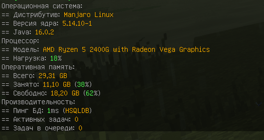

Выводит различную техническую информацию вашей **системы**. Обращается напрямую к ОС, а не к JVM.

Благодаря этому, информация крайне точна.

:::warning Имейте в виду
Данная команда не работает на системах, отличных от Linux. На других системах у вас не получится её включить.
:::



```yaml title="adminCommands/load.yml"
# Включена ли субкоманда?
enabled: true

# Право для субкоманды.
permission: 'baronessauth.admin'

# Описание субкоманды.
description: '- отображает техническую статистику'

# Сообщения с информацией.
#   {os_distro}    - дистрибутив
#   {os_version}   - версия ядра Linux
#   {java_version} - версия Java
#   {cpu_name}     - модель процессора
#   {cpu_load}     - суммарная нагрузка процессора (учёт всех ядер)
#   {ram_total}    - общее количество ОЗУ
#   {ram_used}     - количество занятой ОЗУ (SWAP не считается занятостью)
#   {ram_used_%}   - количество занятой ОЗУ в процентах (SWAP не считается занятостью)
#   {ram_free}     - количество свободной ОЗУ (SWAP считаеся свободной памятью)
#   {ram_free_%}   - количество свободной ОЗУ в процентах (SWAP считаеся свободной памятью)
#   {db_ping}      - время в мс, нужное для исполнения запроса в базу данных
#   {db_name}      - название базы данных
#   {task_active}  - количество активных асинхронных задач
#   {task_queue}   - количество асинхронных задач в очереди
messages:
  - '§7Операционная система:'
  - '§7== Дистрибутив: §l§6{os_distro}'
  - '§7== Версия ядра: §l§6{os_version}'
  - '§7== Java: §l§6{java_version}'
  - '§7Процессор:'
  - '§7== Модель: §l§6{cpu_name}'
  - '§7== Нагрузка: §l§6{cpu_load}§7%'
  - '§7Оперативная память:'
  - '§7== Всего: §l§6{ram_total}'
  - '§7== Занято: §l§6{ram_used}§7 ({ram_used_%}§7%)'
  - '§7== Свободно: §l§6{ram_free}§7 ({ram_free_%}§7%)'
  - '§7Производительность:'
  - '§7== Пинг БД: {db_ping}§7ms (§l§6{db_name}§7)'
  - '§7== Активных задач: §l§6{task_active}'
  - '§7== Задач в очереди: §l§6{task_queue}'
```