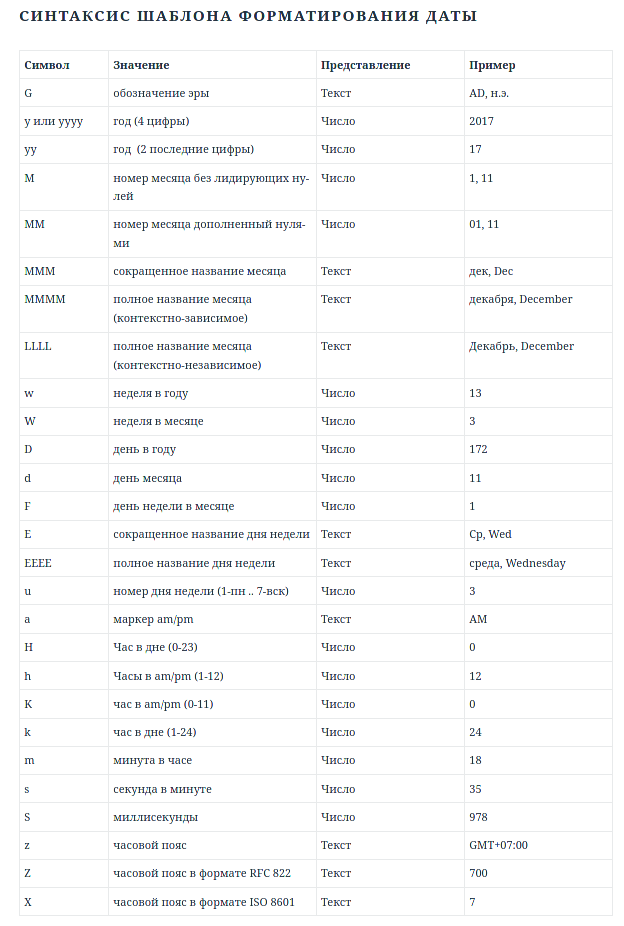

:::tip Примечание
Настройки даты меняют только её отображение и никак не влияют на данные.
:::

```yaml title="data/date.yml"
# Часовой пояс.
timeZone: 'GMT+3'

# Формат даты. Все ключевые символы есть в скриншоте ниже.
format: 'yyyy.MM.dd HH:mm'
```



