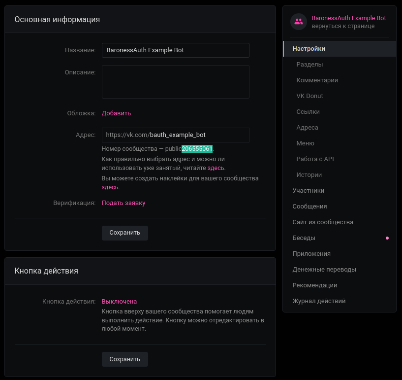
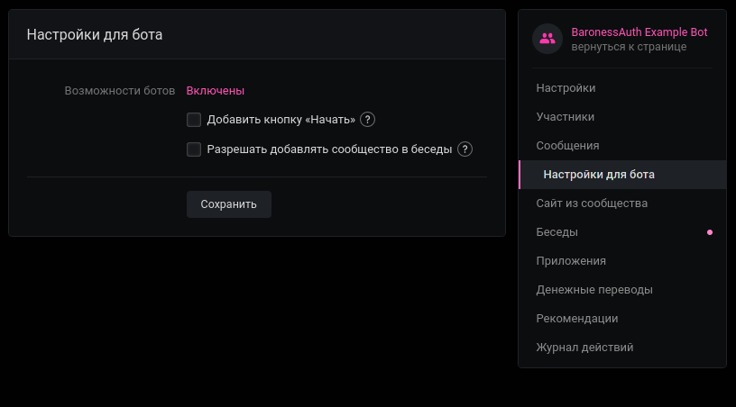
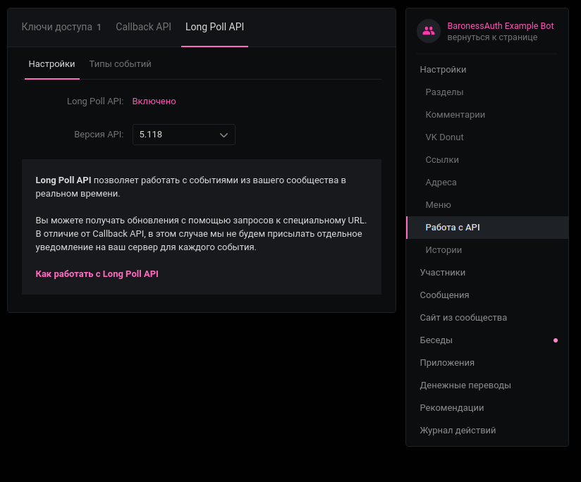
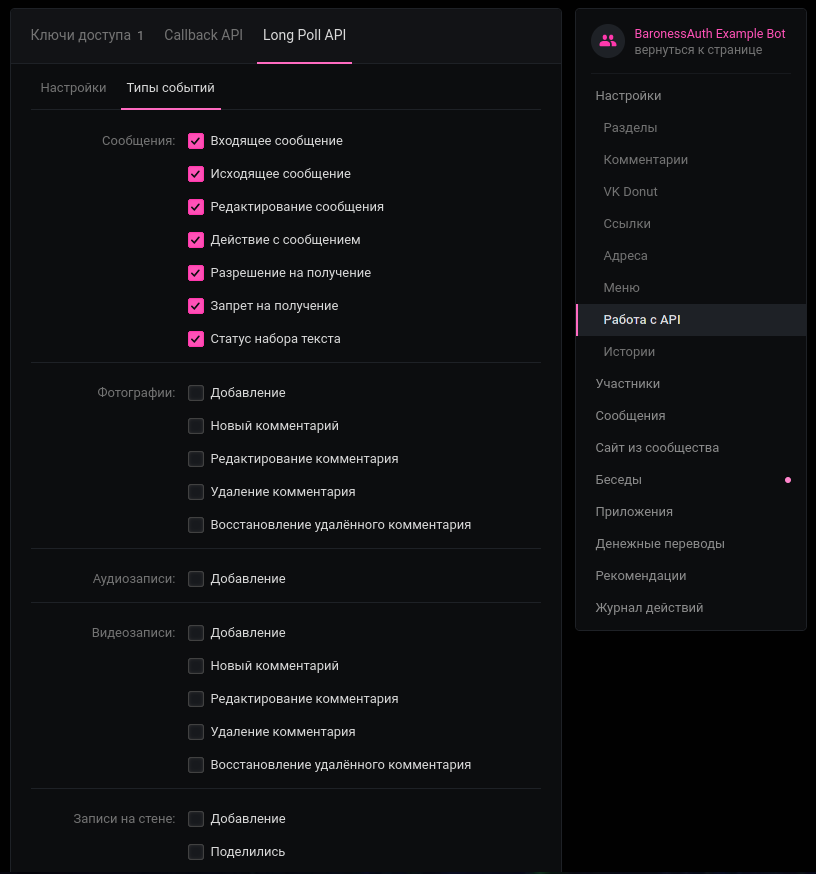

# ВК-Бот провайдер (`vk`)

<center>
Демонстрация: 

[](https://www.youtube.com/watch?v=lfHKTgkuAcw)

</center>

Представляет собой бота ВКонтакте, через которого можно регистрироваться и авторизовываться.
Для регистрации сервер генерирует пятизначный код, который нужно отправить в сообщения бота. Для авторизации бот будет присылать сообщения с ником и IP, а также выводить кнопки "принять" и "отклонить".

Бот сгенерирует очень сложный пароль при регистрации, чтобы не оставлять базу данных пустой. Отправлять этот пароль игроку или нет — выбор за вами. Вы можете отключить команду `/login` для тех, кто использует этот провайдер.

:::tip
YAML часто конфликтует со смайликами, поэтому мы поддерживаем их ввод в виде `:кодов:`.
Если вы пользуетесь Discord, скорее всего, вы знакомы с такими.
Полный список поддерживаемых смайликов и их коды есть [здесь](https://mirror.baronessdev.ru/docs/emojis.json) (коды можно найти в `aliases` и `tags`).
:::

### Создание бота

- Создайте паблик ВКонтакте,
- Зайдите в панель "Управление",
- Скопируйте числовой ID, как на скриншоте 1,
- Задайте настройки, как на последующих скриншотах,

<center>

  
  
  
  

</center>

- Зайдите в Настройки -> Работа с API -> Ключи доступа. Создайте новый ключ, выбрав **все** пункты. Как ни странно, только сообщений не хватает, если не хотите все — можете пробовать добавлять по одному.

## Настройка

```yaml title="authProviders/vk.yml"

# Нужно ли право для использования провайдера.
use-permission: false

# Право для использования провайдера.
permission: 'baronessauth.provider.vk'

# Ключ доступа от сообщества.
token: 'enter-your-vk-longpoll-token-here'

# Числовой ID сообщества.
id: 123

hover:
  # Текст для `required` сообщений, который выводится при наведении.
  text: '§fНажмите, чтобы открыть бота по ссылке.'
  
  # Ссылка для `required` сообщений, которая открывается при клике.
  url: 'https://vk.com/bauth_example_bot'


register:
  messages:
    # Переодически повторяемое сообщение о необходимости зарегистрироваться.
    # {CODE} меняется на код, который нужно отправить боту.
    required: 'Зарегистрируйтесь, написав §6{CODE}§r боту §6@mybot§r в VK.'
    
    # Сообщение об успешной регистрации.
    completed: '§a§lВы успешно зарегистрировались!'
    
    # Ответное сообщение при присылании неизвестного кода.
    vk-error: 'Неизвестный код. Попробуйте перезайти на сервер и получить новый.'
    
    # Сообщение об успешной регистрации (в диалоге), {PASS} меняется на пароль.     
    vk-success: |-
       Вы успешно зарегистрировались!
       Каждый вход будет требовать подтверждения в этом диалоге.
               
       Для вас сгенерирован сложный пароль:
       {PASS}
               
       Вы можете использовать его в экстренных ситуациях.
       
    # Сообщение при кике игрока, если он не зарегистрировался за указанное время.
    kick: '§c§lВремя регистрации истекло.'
    
  # Частота повторения `register.messages.required` в секундах.
  repeat: 4
  
  # Максимальное время для регистрации в секундах.
  timeout: 300
  
  
login:
  messages:
    # Переодически повторяемое сообщение о необходимости авторизоваться.
    required: 'Авторизуйтесь, приняв запрос бота §6@mybot§r в VK.'
    
    # Сообщение об успешной авторизации.
    completed: '§a§lВы успешно авторизованы!'
    
    # Сообщение о неверном пароле.
    false: '§c§lНеправильный пароль.'
    
    # Сообщение при кике игрока, если он не авторизовался за указанное время.
    kick: '§c§lВремя авторизации истекло.'
    
    vk-request:
      # Сообщение владельцу аккаунта, {NICK} - ник, {IP} - IP адрес, откуда запрошен вход.
      message: |-
         На ваш аккаунт ({NICK}) совершается попытка входа с IP-адреса {IP}.
         Если это вы, нажмите на :white_check_mark:, если нет - на :x:.
         Отклонение запроса мгновенно кикнет игрока с сервера.
      
      # Текст кнопки "принять".
      button-1: ':white_check_mark:'
      
      # Текст кнопки "отклонить".
      button-2: ':x:'
      
      # Сообщение о принятии входа, {NICK} - ник, {IP} - IP адрес, откуда запрошен вход.
      accepted: ':white_check_mark: | Разрешён вход {NICK} с {IP}'
      
      # Сообщение об отклонении входа, {NICK} - ник, {IP} - IP адрес, откуда запрошен вход.
      rejected: ':x: | Отклонён вход {NICK} с {IP}'
      
      # Сообщение о том, что запрошенный игрок уже авторизован или вышел с сервера.
      offline: ':thinking:| Похоже, что игрок оффлайн или уже авторизован.'
      
      # Сообщение при кике игрока, если владелец аккаунта отклонил вход. 
      kick: '§c§lВладелец аккаунта отклонил ваш вход.'
      
  # Частота повторения `login.messages.required` в секундах.
  repeat: 4
  
  # Максимальное время для авторизации в секундах.
  timeout: 40
  
  # Определяет, доступна ли команда /login.
  login-command-available: true
```