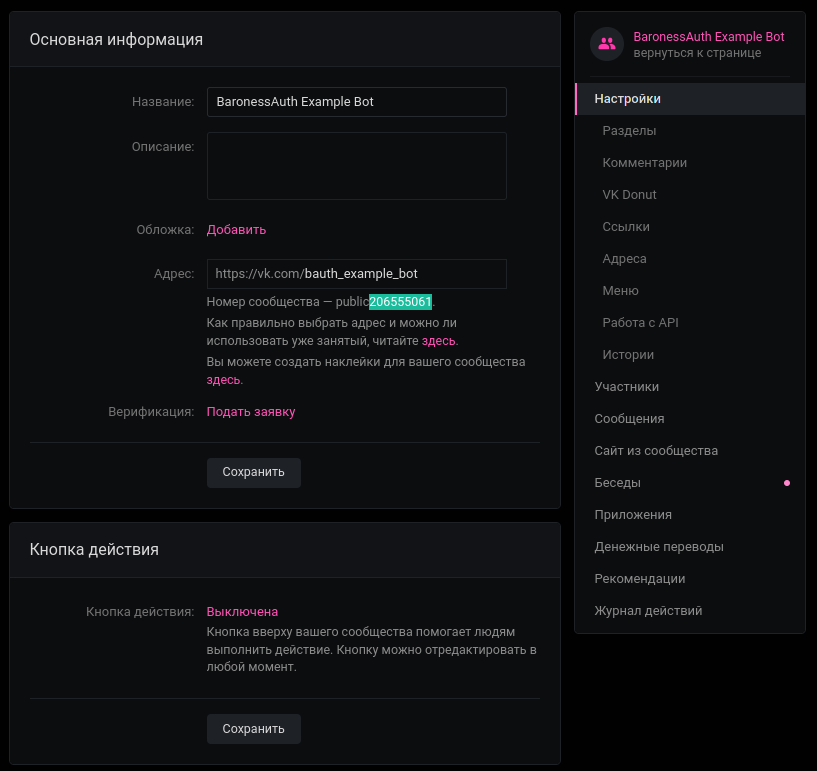
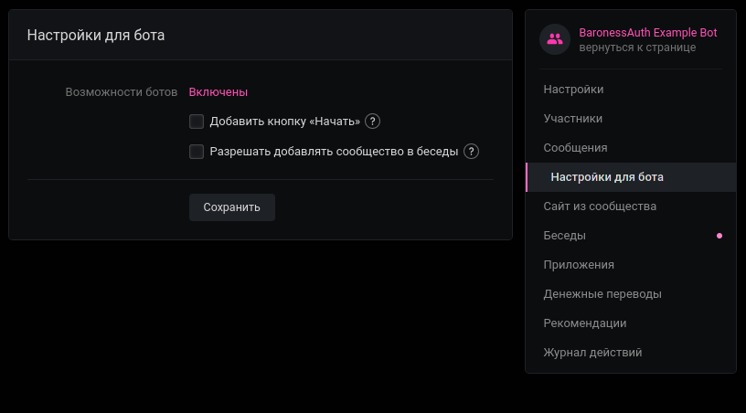
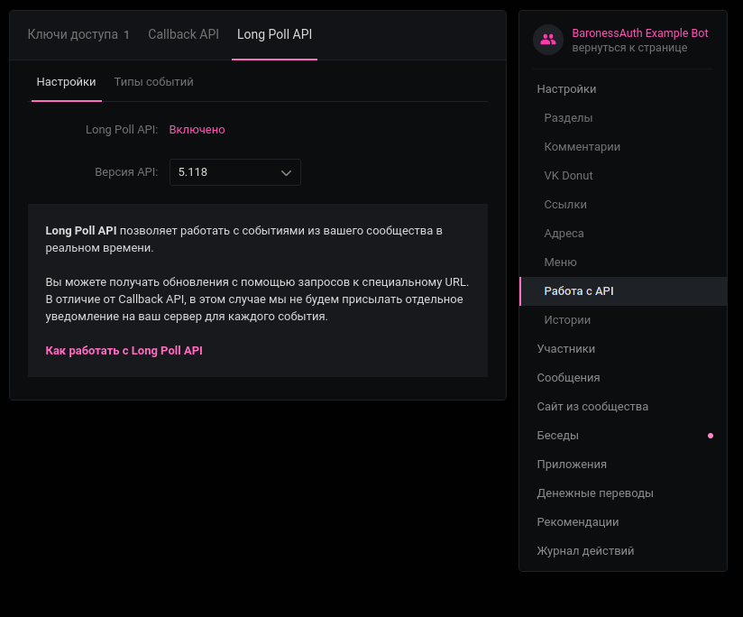
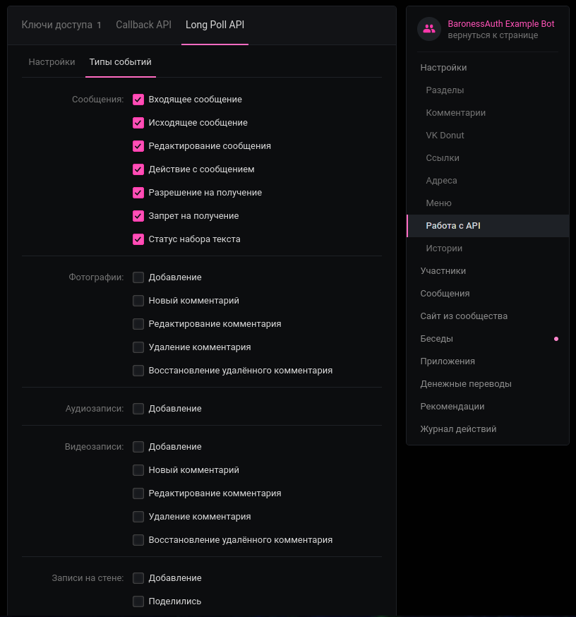

# ВК-Бот провайдер (`vk`)

Демонстрация: 

Представляет собой бота ВКонтакте, через которого можно регистрироваться и авторизовываться.
Для регистрации сервер генерирует пятизначный код, который нужно отправить в сообщения бота. Для авторизации бот будет присылать сообщения с ником и IP, а также выводить кнопки "принять" и "отклонить".

Бот сгенерирует очень сложный пароль при регистрации, чтобы не оставлять базу данных пустой. Отправлять этот пароль игроку или нет — выбор за вами. Вы можете отключить команду `/login` для тех, кто использует этот провайдер.

:::tip
YAML часто конфликтует со смайликами, поэтому мы поддерживаем их ввод в виде `:кодов:`.
Если вы пользуетесь Discord, скорее всего, вы знакомы с такими.
Полный список поддерживаемых смайликов и их коды есть [здесь](https://mirror.baronessdev.ru/docs/emojis.json) (коды можно найти в `aliases` и `tags`).
:::

### Создание бота

- Создайте паблик ВКонтакте,
- Зайдите в панель "Управление",
- Скопируйте числовой ID, как на скриншоте 1,
- Задайте настройки, как на последующих скриншотах,

  
  
  
  

- Зайдите в Настройки -> Работа с API -> Ключи доступа. Создайте новый ключ, выбрав **все** пункты. Как ни странно, только сообщений не хватает, если не хотите все — можете пробовать добавлять по одному.