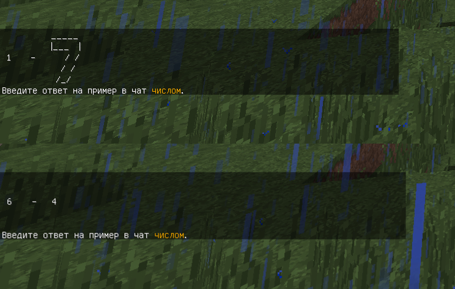

Капча позволяет задать игроку простой арифметический вопрос прямо в чате, используя мультистрочный пример.

Игрок не получает сообщения в чате, чтобы не терять из виду свою капчу.



Пример состоит из трёх частей: 
1. Первое число,
2. Операция,
3. Второе число. 

Числа могут быть от 1 до 9, операция же это сложение или вычитание. 

Вид каждого из них выбирается случайным образом из настроек и может быть изменён.

:::info Примечание
Количество сообщений у каждого символа должно совпадать, иначе некоторые символы будут показываться не полностью (например, стандартные настройки всегда используют 5 строк).
:::

### Как оно работает?

Плагин собирает воедино строчки нужных символов, у каждого из них этих строчек может быть много.

Если всё ещё непонятно, можно представить графически:

```
1:
   - - 'строчка 1-1 '
     - 'строчка 1-2 '
        
2:
   - - 'строчка 2-1 '
     - 'строчка 2-2 '
        
"+":
   - - 'строчка +-1 '
     - 'строчка +-2 '
        
Пример 1+2 будет выглядеть как:

    строчка 1-1 строчка +-1 строчка 2-1 
    строчка 1-2 строчка +-2 строчка 2-2 
```

:::tip Подсказка
Не забывайте, что кроме чисел вы можете писать что угодно. Например, вместо 2 написать dva или 1+1.
:::

```yaml title="security/antibot.yml"
captcha:
  # Сообщение о необходимости ввести капчу.
  message: 
  
  symbols:
      # Варианты символа "+".
      +:
        - - '     '
          - '     '
          - ' +   '
          - '     '
          - '     '
        - - '     '
          - '  +  '
          - '     '
          - '     '
          - '     '
      
      # Варианты символа "-".
      "-":
        - - '     '
          - '     '
          - '  -  '
          - '     '
          - '     '
        - - '     '
          - '     '
          - '     '
          - ' -   '
          - '     '
      
      # Варианты числа 1.
      1:
        - - '    '
          - '    '
          - '    '
          - ' 1  '
          - '    '
        - - '    '
          - '   1'
          - '    '
          - '    '
          - '    '
          
      # Варианты числа 2.
      2:
        - - '    '
          - '   2'
          - '    '
          - '    '
          - '    '
        - - '    '
          - '    '
          - '    '
          - '    '
          - '  2 '
          
      # Варианты числа 3.
      3:
        - - '    '
          - '    '
          - ' 3  '
          - '    '
          - '    '
        - - '    '
          - '   3'
          - '    '
          - '    '
          - '    '
          
      # Варианты числа 4.
      4:
        - - '    '
          - '    '
          - ' 4  '
          - '    '
          - '    '
        - - '    '
          - '4   '
          - '    '
          - '    '
          - '    '
          
      # Варианты числа 5.
      5:
        - - '    '
          - ' 5  '
          - '    '
          - '    '
          - '    '
        - - '    '
          - '    '
          - '    '
          - '   5'
          - '    '
          
      # Варианты числа 6.
      6:
        - - '    '
          - '    '
          - ' 6  '
          - '    '
          - '    '
        - - '   6'
          - '    '
          - '    '
          - '    '
          - '    '
          
      # Варианты числа 7.
      7:
        - - '    '
          - '    '
          - '    '
          - ' 7  '
          - '    '
        - - '    '
          - '   7'
          - '    '
          - '    '
          - '    '
          
      # Варианты числа 8.
      8:
        - - '    '
          - '    '
          - ' 8  '
          - '    '
          - '    '
        - - '8   '
          - '    '
          - '    '
          - '    '
          - '    '
      
      # Варианты числа 9.
      9:
        - - '    '
          - '    '
          - ' 9  '
          - '    '
          - '    '
        - - '    '
          - '    '
          - '    '
          - '   9'
          - '    '
```