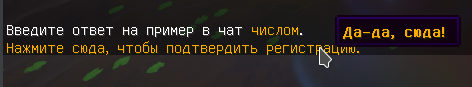

Создаёт кликабельное сообщение с призывом нажать на него. 

Игрок не получает сообщения в чате, чтобы не терять из виду это сообщение.



```yaml title="security/antibot.yml"
click:
  # Текст с призывом нажать.
  text: '§6Нажмите сюда, чтобы подтвердить регистрацию.'
  
  # Текст, показывающийся при наведении курсора.
  hover: '§6§lДа-да, сюда!'
```