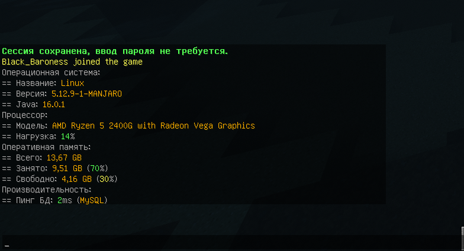
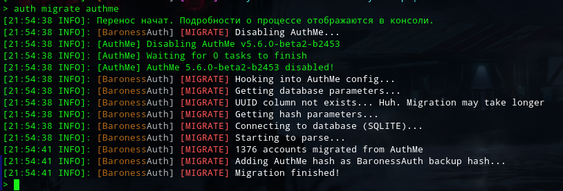
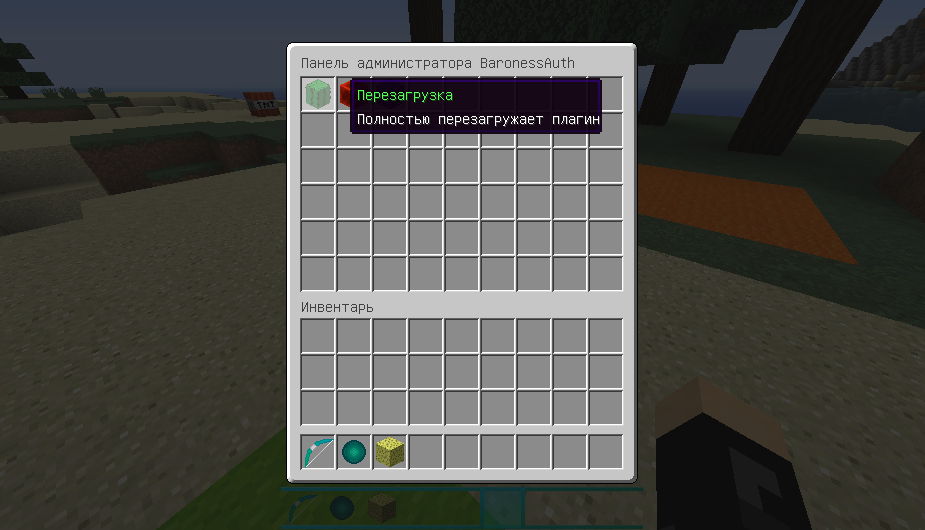

```mdx-code-block
import Tabs from '@theme/Tabs';
import TabItem from '@theme/TabItem';
```

## v0.1.0-beta

<Tabs
defaultValue="added"
values={[
{label: "Добавлено", value: "added"},
{label: "Изменено", value: "changed"},
{label: "Исправлено", value: "fixed"}
]}>

<TabItem value="added">

- Настройка кэширования базы данных.
- Дополнительная информация о платформе при включении плагина.
- Предупреждение, если сервер использует версию ниже 1.8.

</TabItem>
<TabItem value="changed">

- Плагин перешёл на [Семантическое Версионирование](https://semver.org/lang/ru/).
- Обновлены некоторые библиотеки.
- Файл `config.yml` переименован в `settings.yml`, чтобы убрать проблемы с попыткой Bukkit самостоятельно прочесть файл.
- Теперь скачиваемые базы данных удаляются только после того, как скачивание новой версии завершится. Это избавит от проблем, когда новая версия не качается, а старая удалена.
- Теперь HEX цвета используются иначе. Подробности в [FAQ](faq.md).
- Ускорена обработка HEX цветов для тех сообщений, где она не используется (короче говоря, плагин не будет пытаться её использовать, когда она не нужна).

</TabItem>
<TabItem value="fixed">

- YAML читалось некорректно и создавало странные ошибки.
- Кэширование базы данных, из-за ошибки которого уже зарегистрированному игроку могло предложить регистрацию.
- Предупреждение "...does not specify an api-version" на новых версиях.
- Заморозка `spigot` включалась на 1.8 и вызывала ошибки. Теперь не включается.
- SQLite могла не работать на 1.8 из-за незагруженного драйвера.
- Мелкие шероховатости в стандартных настройках.

</TabItem>
</Tabs>


## v232

<Tabs
defaultValue="added"
values={[
{label: "Добавлено", value: "added"},
{label: "Изменено", value: "changed"},
{label: "Исправлено", value: "fixed"},
{label: "Удалено", value: "deleted"}
]}>

<TabItem value="added">

- Новая система разбития задач на потоки. Производительность может увеличиться.
- Расширенная документация о скриптах.

</TabItem>
<TabItem value="changed">

- Теперь, если файл конфигурации невалиден (сломанный YAML синтаксис), плагин сообщит об этом в консоль, укажет на ошибку и загрузит стандартный вариант конфигурации. Ранее это приводило к сбросу всех секций.
- Ускорена обработка YAML файлов.

</TabItem>
<TabItem value="fixed">

- Кэширование базы данных, которое могло приводить к несостыковкам.
- Нерабочая MySQL.
- Неправильно отображающийся Tab Complete.
- Не адаптирующийся к aliases лог фильтр. Теперь адаптируется динамически.
- Некоторые опечатки в файлах конфигурации.

</TabItem>

<TabItem value="deleted">

- `task_active` и `task_active` у `load` субкоманды - бесполезны.

</TabItem>
</Tabs>

## v231

<Tabs
defaultValue="added"
values={[
{label: "Добавлено", value: "added"},
{label: "Изменено", value: "changed"},
{label: "Исправлено", value: "fixed"},
{label: "Удалено", value: "deleted"}
]}>

<TabItem value="added">

- Новая система кэширования базы данных, что уменьшает количество запросов в несколько раз.
- Cached Database API - для доступа к кэшу базы данных из API.
- Новая конфигурация в 3 файла, с подробными комментариями.
- Своя реализация YAML, которая функциональнее и быстрее встроенной в ядро.
- Настройки aliases для всех команд и субкоманд.
- Настройки tab complete для большинства команд. 
- Базовые настройки `/auth developer`.
- Система дампов, позволяющая создавать гибкие бэкапы, применимые к любой базе данных.
- Новая система статистики, которая теперь не имеет настроек и основана только на базе данных.
- Команда `/logout`, позволяющая игрокам сбросить свою сессию.

</TabItem>
<TabItem value="changed">

- Оптимизированы все базы данных. Особенно MySQL.
- Улучшено "родное" оформление classic провайдера.
- Обновлен Telegram API.
- Обновлен VK API.
- Обновлены многие библиотеки.
- Ускорена генерация строк и оптимизированы многие алгоритмы генерации случайных чисел.
- Оптимизирована защита от брутфорса.
- Оптимизирован подсчёт защиты от быстрого переподключения - теперь не влияет на тики.
- Массивный рефакторинг и общая оптимизация кода.

</TabItem>
<TabItem value="fixed">

- Миграция с AuthMe могла не работать в некоторых случаях.

</TabItem>

<TabItem value="deleted">

- Старые файлы конфигов - заменены новыми.
- Обращение к папке `backup` - заменена `dump`.
- Субкоманда `clean` - больше не нужна.
- Субкоманда `backup` - заменена `dump`.

</TabItem>
</Tabs>

:::caution Важно!
Полностью переделаны все конфиги, плагин нужно настроить заново.

Вы можете удалить папки `config`, `backup`, а также теперь ненужную таблицу в бд:

```/auth developer --execute_sql_plain=ALTER TABLE -table- DROP COLUMN `logged`;```
:::

## v230

<Tabs
defaultValue="added"
values={[
{label: "Добавлено", value: "added"},
{label: "Изменено", value: "changed"},
{label: "Исправлено", value: "fixed"}
]}>

<TabItem value="added">

- Новая система обнаружения дистрибутива для `/auth load`, имя дистрибутива теперь можно узнать через `{os_distro}`. Ранее он обнаруживался вместе с версией и отображался некорректно на некоторых системах.
- HEX и `&` цвета у тайтлов и у причин кика с сервера.

</TabItem>
<TabItem value="changed">

- Увеличена скорость обращения к системе для `/auth load`.
- Заполнитель `{os_version}` у `/auth load` теперь отображает версию ядра Linux.
- Некоторые стандартные настройки "классического" провайдера стали визуально приятнее.

</TabItem>
<TabItem value="fixed">

- При регистрации через "классический" провайдер не отправлялся тайтл успешной регистрации.

</TabItem>
</Tabs>

## v229

<Tabs
defaultValue="added"
values={[
{label: "Добавлено", value: "added"},
{label: "Изменено", value: "changed"},
{label: "Исправлено", value: "fixed"}
]}>

<TabItem value="added">

- Кэширование GeoIP. Загружает данные в ОЗУ, потребляя ~2МБ, но увеличивая скорость. По умолчанию включено.
- Поддержка HEX цветов.
- Поддержка градиентов.
- Поддержка `&` для установки цвета.
- `Title` и `Subtitle` для "классического" провайдера.
- Новая система отложенных задач, повышающая производительность.
- Двойная буферизация там, где её до этого не было. Минорное улучшение производительности.

</TabItem>
<TabItem value="changed">

- **Значительно** увеличена производительность баз данных.
- Теперь GeoIP база данных скачивается с серверов Baroness` Dev.
- Переписана, тем самым значительно улучшена и оптимизирована система логирования и фильтра логов сервера.
- Ускорена работа и снижено потребление ОЗУ у ботов-провайдеров.
- Ускорена работа генератора случайных чисел.
- Обновлён Telegram API.
- Обновлён VK API.
- Обновлён драйвер PostgreSQL.
- Обновлён драйвер HSQLDB.

</TabItem>
<TabItem value="fixed">

- В редких случаях плагин мог не запускаться на Java 8.
- Система подсчёта твинков работала некорректно.
- Субкоманды `unregister` и `unfreeze` в подсказке были частично перепутаны местами.
- Проверка `click` у антибота вызывала лог о якобы "введённой команде".
- После каждого срабатывания автоматического бэкапа, появлялся бесполезный лог о перепланировании задачи.

</TabItem>
</Tabs>

## v228

<Tabs
defaultValue="changed"
values={[
{label: "Изменено", value: "changed"},
]}>


<TabItem value="changed">

- Все ссылки на документацию заменены на рабочие, если возможно. Файлы, чья документация ещё не готова, лишились ссылок. На данный момент ссылки имеют 75% файлов.

</TabItem>
</Tabs>

## v227

<Tabs
defaultValue="added"
values={[
{label: "Добавлено", value: "added"},
{label: "Изменено", value: "changed"},
{label: "Исправлено", value: "fixed"},
{label: "Удалено", value: "deleted"},
]}>

<TabItem value="added">

- Локальная база данных HSQLDB - прекрасная замена медленной SQLite.
- Система режимов заморозки.
- Режим заморозки "Paper" - более ресурсоэффективная заморозка, работающая только с Paper.
- Возможность включить\отключить блокирование падения при заморозке.
- Автоматическая починка неправильных настроек, если возможно. Если невозможно, настройка будет сброшена, чтобы не ломать работу плагина.
- Функция `--optimize-HSQLDB` в `/auth developer`.
- Минимальная и максимальная длина ника.

</TabItem>

<TabItem value="changed">

- VK API обновлён до последней версии.
- Улучшены индексы SQLite, что повысит производительность при большом количестве регистраций.
- Теперь стандартная база данных это HSQLDB.
- Переписана логика скачивания баз данных.
- Окончательно переписана логика настроек. Ещё быстрее уже не будет.
- Ускорено сохранение ресурсов (файлов настроек).
- Ускорена проверка пароля на слив.
- Ускорена валидация файла плагина.
- Ускорено получение данных системы `/auth load`.
- Ускорено скачивание файлов (на хостингах обычно нет разницы, так как диск медленнее интернет-канала).
- Теперь фильтры логов устанавливаются динамически, их можно отключать без перезагрузки сервера.
- Полностью изменена настройка базы данных, для большего удобства.
- Файл настройки базы данных переименован (`data/data.yml -> data/database/yml`).
- Теперь `/auth developer` принимает только 1 функцию за раз. Это даёт возможность использовать пробелы.

</TabItem>

<TabItem value="fixed">

- Нельзя было запустить одновременно 2 разных бота (и Telegram, и ВК).
- Если во время скачивания базы данных написать `/auth reload`, вызвав этим повторное скачивание, скачивания накладывались друг на друга и вызывали ошибку.

</TabItem>

<TabItem value="deleted">

- Базу данных YAML, так как она была бесполезна.

</TabItem>

</Tabs>

:::info Примечание
Документация к этому обновлению готова не полностью.

Если у вас всё работает, лучше подождать следующего обновления.
:::

## v226

```mdx-code-block
<Tabs
defaultValue="added"
values={[
{label: "Добавлено", value: "added"},
{label: "Исправлено", value: "fixed"},
]}>

<TabItem value="added">
```
- Ссылки на документацию в большинстве файлов настроек.
```mdx-code-block
</TabItem>

<TabItem value="fixed">
```
- Проверка UUID на SQLite вызывала ошибку.
```mdx-code-block
</TabItem>
</Tabs>
```

## v225

```mdx-code-block
<Tabs
defaultValue="added"
values={[
{label: "Добавлено", value: "added"},
{label: "Изменено", value: "changed"},
{label: "Исправлено", value: "fixed"},
{label: "Удалено", value: "deleted"},
]}>

<TabItem value="added">
```
- Уникальная система AuthProvider.
- **VK-бот для регистрации и авторизации.**
- Новая система задач, более умно распределяющая нагрузку между ядрами.
- Возможность выдать право на использование "классической авторизации".
- Возможность отключить `/login` при использовании Telegram-бота.
- Возможность настроить права на каждую отдельную субкоманду.
- Предупреждение о том, что асинхронных задач прибавляется больше, чем выполняется.
- Предупреждение при использовании нерекомендуемых баз данных.
- Предупреждение о том, что в настройках выставлен не тот тип, который нужен (например, вместо `true`-`false` вписано
  число).
- Параметр `task_active` у `/auth load`, отображащий активные асинхронные задачи.
- Параметр `task_queue` у `/auth load`, отображащий асинхронные задачи в очереди.
- Вывод всех последних входов с IP при использовании `/auth stats ip`.
- Вывод не только страны, но и города при использовании `/auth stats ip`.
- Вывод страны и города для IP при использовании `/auth stats nick`.
- `Callback` у сохранения профиля игрока через API.
```mdx-code-block
</TabItem>

<TabItem value="changed">
```
- Полностью переписан Telegram-бот. Его принцип изменён, а сам бот стал мультисерверным.
- Скорость доступа к настройкам в реальном времени увеличена вплоть до 5800%. Эффект также распространяется на многие
  функции: антибот, боты-провайдеры, "запросы".
- Скорость работы со списками увеличена вплоть до 21%.
- Скорость генерации соли увеличена почти в 2 раза.
- Переписано большинство SQL запросов, их количество уменьшено до минимума.
- Теперь в ссылке для подключения к базе данных необязательно указывать префикс JDBC (например, `jdbc:mysql://`). Но,
  даже если префикс указан, подключение будет работать.
- Обновлено множество библиотек.
- Улучшена валидация IP при `/auth stats ip`.
- Улучшена надёжность защиты от подмены UUID.
- Улучшен вызов задачи в Bukkit (серверном) потоке.
- Ускорены логи в файл.
- Ускорена работа проверки `click` антибота.
- Ускорено выполнение запроса `WAIT` у скриптов.
- Максимально оптимизированы все функции заморозки.
- Оптимизирована проверка сложности пароля.
- Оптимизирован антибот.
- Оптимизирована субкоманда `/changepassword`.
- Снижена нагрузка на базу данных при использовании `checkCase` у фильтра ников.
- Небольшой рефакторинг всех проверок при подключении.
- `db_name` у `/auth load` теперь пишется в правильном регистре.
- Имя базы данных при включении плагина теперь пишется в правильном регистре.
- Теперь проверка на твинков учитывает не только IP регистрации, но и IP последнего входа.
- Теперь `/auth stats ip` выводит не только регистрации, но и последние входы с IP.
```mdx-code-block
</TabItem>

<TabItem value="fixed">
```
- После восстановления настройки плагин её не видел.
- Вызов `/auth stats total` на пустом сервере (без единой регистрации) вызывал ошибку.
- Выдача сессии в другом потоке могла вызвать ошибку.
- Субкоманда `/auth backup` не выключалась.
```mdx-code-block
</TabItem>

<TabItem value="deleted">
```
- DEBUG логи о добавлении субкоманды.
- DEBUG логи об удалении субкоманды.
- DEBUG логи о регистрации слушателя.
- Конфиг-файлы: `register.yml`, `login.yml`. Теперь это настраивается в Classic AuthProvider.
- Параметр `os_name` у `/auth load`, так как он всегда равняется Linux.
- Функция `Smart Freeze Optimizing`, так как теперь она не имеет никакого эффекта.
```mdx-code-block
</TabItem>
</Tabs>
```

## v224

```mdx-code-block
<Tabs
defaultValue="added"
values={[
{label: "Добавлено", value: "added"},
{label: "Изменено", value: "changed"},
{label: "Исправлено", value: "fixed"},
]}>

<TabItem value="added">
```
- Асинхронные автоматические бэкапы.
- Субкоманда /auth backup для ручного бэкапа.
- Инструменты разработчика: выполнение SQL-запросов из файла или напрямую из чата.
- Добавлен метод `AuthDataManagerAPI#backup` для API.
```mdx-code-block
</TabItem>

<TabItem value="changed">
```
- Обновлён модуль защиты от Proxy/VPN.
```mdx-code-block
</TabItem>

<TabItem value="fixed">
```
- YAML работал некорректно.
```mdx-code-block
</TabItem>
</Tabs>
```

## v223

```mdx-code-block
<Tabs
defaultValue="added"
values={[
{label: "Добавлено", value: "added"},
{label: "Изменено", value: "changed"},
]}>

<TabItem value="added">
```
- Алгоритмы хеширования: MD2, MD4, SHA0, SHA3\_224, SHA3\_256, SHA3\_384, SHA3\_512, Tiger, Tiger2, Tiger128, Tiger160, BLAKE2B\_160, BLAKE2B\_256, BLAKE2B\_384, BLAKE2B\_512, Whirlpool\_0, Whirlpool\_1, Whirlpool\_2.
- CRC: CRC8, CRC16, CRC24, CRC64.
- Бенчмарк для всех алгоритмов хеширования (тут).
- Уведомление для админов об обновлении. Доступна задержка. Особенностью является то, что можно вписать любой ивент-класс, имеющий метод getPlayer. Выводится кликабельное сообщение.
- Автоматическое удаление ненужных .currentConfig файлов и пустых папок в doNotTouch.
```mdx-code-block
</TabItem>

<TabItem value="changed">
```
- Теперь имя алгоритма хеширования не чувствительно к регистру (SHA256 = sha256 = ShA256).
- Теперь стандартными настройками хеширования являются Tiger128+SALT+Tiger128.
- Адрес зеркала для базы данных прокси изменён. Прошлое зеркало продолжит быть активным, для поддержки старых версий, но не будет обновляться.
```mdx-code-block
</TabItem>
</Tabs>
```

## v222

Это обновление влияет только на API и не меняет работу плагина.

```mdx-code-block
<Tabs
defaultValue="added"
values={[
{label: "Добавлено", value: "added"},
{label: "Изменено", value: "changed"},
]}>

<TabItem value="added">
```
- Jetbrains Annotations ко всем полям и методам.
```mdx-code-block
</TabItem>

<TabItem value="changed">
```
- PlayerProfile, QueryType перенесены в пакет API.
- Переписаны некоторые JavaDocs, добавлены там, где их не хватало.
```mdx-code-block
</TabItem>
</Tabs>
```

## v221

```mdx-code-block
<Tabs
defaultValue="added"
values={[
{label: "Добавлено", value: "added"},
{label: "Изменено", value: "changed"},
]}>

<TabItem value="added">
```
- AuthHashManagerAPI#reload для API.
```mdx-code-block
</TabItem>

<TabItem value="changed">
```
- Переписана система хеширования, скорость увеличена в несколько раз.
```mdx-code-block
</TabItem>
</Tabs>
```

## v220

```mdx-code-block
<Tabs
defaultValue="added"
values={[
{label: "Добавлено", value: "added"},
{label: "Изменено", value: "changed"},
]}>

<TabItem value="added">
```
- Автоматическая миграция с AuthMe. Работают все базы данных, а все данные о базе BaronessAuth получает самостоятельно. Для подробностей прочтите соответсвующую страницу в Инструкциях.
- Субкоманда /auth migrate для управления миграциями.
- Субкоманда /auth load для отображения системной статистики. Работает только на Linux и получает максимально точную информацию напрямую из системы.
- `AuthDataManagerAPI#saveProfileSynchronously` для API.
- Новая система асинхронности. Бенчмарки показали, что скорость, сравнивая со стандартной, вырастает вплоть до 93%.

  
  
```mdx-code-block
</TabItem>

<TabItem value="changed">
```
- Кэш мог не догрузиться ко входу игрока и предложить ему зарегистрироваться. Это происходило при большом пинге до базы данных.
```mdx-code-block
</TabItem>
</Tabs>
```

## v219

```mdx-code-block
<Tabs
defaultValue="changed"
values={[
{label: "Добавлено", value: "changed"},
]}>

<TabItem value="changed">
```
- Работа асинхронных запросов в MySQL, PostgreSQL, SQLite. Это уменьшит задержку между вводом /register и успешной регистрацией.
```mdx-code-block
</TabItem>
</Tabs>
```

## v218

```mdx-code-block
<Tabs
defaultValue="added"
values={[
{label: "Добавлено", value: "added"},
{label: "Изменено", value: "changed"},
{label: "Исправлено", value: "fixed"},
]}>

<TabItem value="added">
```
- Асинхронные «запросы» для игроков.
- Асинхронное кэширование данных игрока на этапе подключения. Это убирает запросы в базу данных при регистрации\\авторизации, а также ощутимо ускоряет процесс валидации.
- Асинхронная антибот система при регистрации.
- Новая проверка антибота: кликабельное сообщение.
- Запрос «ANTIBOT» для игрока.

<center>
Демонстрация работы текущих 2-х антибот проверок:

[](https://www.youtube.com/watch?v=aCIMFPvOEiY)

</center>

```mdx-code-block
</TabItem>

<TabItem value="changed">
```
- Капчи перенесены в антибот (security/captcha -> antibot). Изменены названия некоторых секций, но заполнение осталось тем же.
- Немного уменьшено количество кэшируемых настроек за счёт выгрузки ненужных. Это снизит потребление ОЗУ и слегка ускорит скорость обращения к настройкам.
- Произведён рефакторинг регистрации «родных» субкоманд для админов. Этот процесс стал быстрее.
- Обновлен драйвер PostgreSQL.
```mdx-code-block
</TabItem>

<TabItem value="fixed">
```
- Имя временного файла архива с базой данных GeoIP появлялось в корне плагина, а не в служебной папке.
- Капчи отображались, даже если они отключены.
```mdx-code-block
</TabItem>
</Tabs>
```

## v217

```mdx-code-block
<Tabs
defaultValue="added"
values={[
{label: "Добавлено", value: "added"},
{label: "Изменено", value: "changed"},
]}>

<TabItem value="added">
```
- AuthPluginReloadEvent для API.
```mdx-code-block
</TabItem>

<TabItem value="changed">
```
- Теперь база данных прокси качается только с нашего зеркала.
- Размер файла плагина уменьшен на 30%.
- Обновлена документация для API.
- Минорные изменения для оптимизации работы прокси-чекера.
```mdx-code-block
</TabItem>
</Tabs>
```

## v216

```mdx-code-block
<Tabs
defaultValue="added"
values={[
{label: "Добавлено", value: "added"},
{label: "Удалено", value: "deleted"},
]}>

<TabItem value="added">
```
- Автоматическое скачивание и обновление базы данных прокси.
- Белый список IP, которые не проходят проверку на прокси.
- Защита от "null ip".
- Ограничение входа по белому\чёрному списку стран, с названиями на русском языке. Нужная база данных скачиваниется и обновляется автоматически. Есть белый список IP.
- Возможность узнать страну происхождения IP через /auth stats ip [ip]. Результат выдаётся, даже если игрока с таким IP нет.
```mdx-code-block
</TabItem>

<TabItem value="deleted">
```
- Настройка имени файла базы данных прокси, так как теперь это происходит автоматически.
```mdx-code-block
</TabItem>
</Tabs>
```

## v215

```mdx-code-block
<Tabs
defaultValue="added"
values={[
{label: "Добавлено", value: "added"},
{label: "Изменено", value: "changed"},
]}>

<TabItem value="added">
```
- Система капч при регистрации (конечно же, её можно отключить). Перед успешной регистрацией для игрока генерируется простая задача на сложение\вычитание и выводится на экран, числа и знаки мультистрочные и случайно выбираются из ваших настроек. Пока игрок вводит капчу, он не получает сообщения из чата и продолжает быть в заморозке. Вы можете оформить любую цифру так, как вам хочется. Большие символы труднее распознать ботам, но игра не всегда позволяет их корректно отобразить.

  
```mdx-code-block
</TabItem>

<TabItem value="changed">
```
- Стандартное ожидание регистрации увеличено с 60с до 100с.
```mdx-code-block
</TabItem>
</Tabs>
```

:::danger Внимание
Вы уходите слишком далеко. Вы уверены, что готовы открыть для себя эту часть истории?
:::

# v214

**Добавлено:**

- Защита от "you logged in from another location".

**Изменено:**

- Настройки, касающиеся анти-прокси, перенесены в общий конфиг подключений
`(security/proxy -> security/connections)`.

# v213

**Добавлено:**

- Предположение о вводимой субкоманде /auth, если таковая не существует.

**Изменено:**

- Размер файла плагина уменьшен на 86%.
- Ускорены алгоритмы хеширования: MD5, SHA1, SHA256, SHA384, SHA512.
- Ускорено создание соли.

**Исправлено:**

- В редких случаях пароль игрока не подходил.

# v212

**Добавлено:**

- Анти-прокси. Для его работы нужны дополнительные настройки - [неактуально].
- Интервал на переподключение к серверу.

**Изменено:**

- Полностью переписана логика принятия подключения к серверу. Проверки ника\интервала\UUID\твинков\прокси\брутфорса стали быстрее.

# v211

**Добавлено:**

- Логирование в файл: при регистрации, успешной авторизации, безуспешной авторизации, сработавшем антибрутфорсе, входе с сохранением сессии, смене пароля. Везде указывается ник и IP, а также доп. информация (если уместно). Логи по умолчанию отключены.
- Другой подход к многопоточной работе с базами данных, что может повысить производительность.

**Изменено:**

- Теперь DDL запросы в базу данных тоже асинхронные.
- Теперь при попытке использовать CRC32 на Java <9 выходит предупреждение.
- Немного ускорено создание MD5 хеша.

**Исправлено:**

- В редких случаях соль была на пару символов короче, чем должна.

# v210

**Добавлено:**

- Режим "legacy" заморозки, которая использует тот самый метод, который был у нас вплоть до v153 `(security/freeze)`.
- Новые "особые аргументы" для скриптов, которые позволяют переносить игрока на другой BungeeCord сервер или ожидать.
- `AuthPlayerSessionSavedEvent` в API.

**Изменено:**

- Получение актуальных настроек из кэша ускорено на ~30%.
- Произведён рефакторинг логики заморозки.

**Исправлено:**

- Работа на Spigot 1.8.

# v209

**Добавлено:**

- Возможность запретить игроку менять регистр своего ника `(security/nickFilter)`.
- Пользовательские скрипты, разнообразнее, чем было до v200.
- Возможность всегда устанавливать игрокам стандартную скорость после входа.
- Проверка обновлений через Магазин. Молчит, если установлена последняя версия.
- Tab-Complete для **всех** команд.
- Поддержка фреймворка ACF для создания команд через аддоны.
- Новые ивенты API.

# v208

**Добавлено:**

- Новый, на этот раз непробиваемый и быстрый способ заморозки. Для него используются сразу 3 механики: изменение скорости, фантомные блоки и фиксация по Y через телепортацию.
- `security/freeze.yml_move.block` для настройки фантомного блока.
- `security/freeze.yml_move.period` для настройки частоты обновления фантомных блоков и фиксации.

**Исправлено:**

- Баг, из-за которого скорости игрока сбрасывались после рестарта сервера. Теперь они асинхронно сохраняются для таких ситуаций.

**Удалено:**

- `security/freeze.yml_preventJump`, так как блокировка движения теперь включает в себя это.

Новые функции тестировались на Paper 1.12.2 и Purpur 1.16.5.

<center>
Демонстрация работы заморозки:

[](https://www.youtube.com/watch?v=drdgB8DkDzI)

</center>

# v207

**Добавлено:**

- `preventJump` при заморозке.
- Настройки стандартной скорости движения и полёта в `security/freeze.yml`. Если игрок зашёл на сервер, имеет скорость 0, для разморозки BaronessAuth установит прошлую скорость из своей памяти или, если её нет, стандартную скорость.

**Исправлено:**

- Баг, из-за которого плагин не запускался на Java 11. Тестировалось на OpenJDK.
- Баг, из-за которого игрок мог заморозиться "намертво", перезайдя без авторизации.

# v206

**Добавлено:**

- Добавлен `blockInventoryClick` при заморозке. Это позволяет блокировать любые клики по любым инвентарям.
- Добавлен новый способ блокировки движения игрока. Он плавный и не "дёргает" клиент, а также не создаёт никакой нагрузки на сервер. Но теперь блокировка X, Y, Z, Pitch, Yaw по отдельности невозможна, игрок просто лишается возможности ходить, но не вертеть камерой.

**Исправлено:**

- Исправлен баг, из-за которого MySQL не работала на некоторых JDK.

**Удалено:**

- `moveHandlers` в `security/freeze.yml` в связи с переработкой фризера.

# v205

- Добавлен blockHeal при заморозке
- Исправлена кодировка MySQL, из-за которой некоторые версии СУБД не поддерживались
- Отшлифовали запросы MySQL, убрав нехорошие кавычки у чисел
- Отказались от обфускатора из-за репортов о нестабильности
- Обновили API
- Изменили способ чтения настроек
- Сообщения о создании папок, новых файлов конфигов, удалении\добавлении секций теперь выводятся не в DEBUG, а в UPDATE
- Дебаг теперь выключается полностью
- Добавлена субкоманда /auth gui, которая открывает GUI
- Добавлено GUI. На данный момент в нём есть 3 кнопки: reload, transform in и transform out. Аддоны могут добавлять собственные кнопки через API
- Добавлены настройки кнопок для соответствующих команд. Если вы отключите какую-то из команд, кнопка не появится
- Добавлены настройки GUI
- Обновлён аддон HideLocation: теперь локации сохраняются при выключении сервера
- Обновлён аддон AuthImport: адаптирован под новый API
- Улучшен процесс перезагрузки настроек фризера
- Добавлена возможность отключить сброс сессий при включении



# v204

- Исправлены некорректно работающие конфиги заморозки
- Добавлен blockEntityInteract при заморозке
- Добавлен blockProjectile при заморозке
- Добавлен blockChat при заморозке
- Добавлен blockTeleport при заморозке. Блокирует только в том случае, если чанк игрока изменился
- Изменено расположение настроек. Пожалуйста, проверьте их, прежде чем устанавливать плагин на продакшн!
- Теперь при проверке конфига плагин выявляет неиспользуемые файлы, меняет их расширение на .old и предупреждает об этом в дебаг
- Добавлена субкоманда /auth clean, которая удаляет все .old конфиги и пустые папки
- Добавлена субкоманда /auth unregister, которая позволяет удаляет все данные игрока из базы данных
- Добавлена субкоманда /auth setpassword, которая позволяет сменить пароль игроку
- Добавлена субкоманда /auth unfreeze, которая позволяет снять заморозку с игрока

# v203

- Исправлены нерабочие в SQLite сессии
- Исправлен подсчёт количества твинков
- Добавлена полная конфигурация админских команд, вплоть до выключения отдельных из них
- Добавлена различная статистика через команду /auth stats
- Добавлена статистика сервера: онлайн сейчас, количество авторизаций за сегодня и за месяц, количество регистраций за сегодня, за месяц и за всё время
- Добавлена статистика игроков: статус, дата регистрации и последнего входа, IP в момент регистрации и последний IP
- Добавлена статистика IP: количество зарегистрированных с него аккаунтов и перечисление каждого из них
- Добавлена настройка часового пояса и формата даты, на сохранённые данные не влияет
- Добавлен фильтр, скрывающий в консоли ввод игроками "reg", "l", "changepassword" и их алиасов
- Переработан конфиг проверки силы пароля
- Добавлен новый фильтр пароля, запрещающий игрокам использовать в качестве пароля свой же ник
- Добавлены новые опции дебага, для DDL и DHL SQL-запросов. По умолчанию отключены
- Мелкие исправления

# v202

- Добавлен blockDrop при заморозке
- Добавлен blockPickup при заморозке

# v201

- Добавили рабочий PostgreSQL
- Исправили неудобные дефолтные конфиги
- Изменён API. Для аддона Hide Location нужна новая версия

## v200
:::info Заметка
Очень важный шаг разработки плагина, когда он был полностью переписан с нуля.
Это решение позволило значительно улучшить производительность и надёжность.
:::

- Добавлена проверка сложности пароля по базе слитых паролей (600+млн)
- Добавлены расширенные настройки твинков, в том числе и репорты
- Добавлен Telegram бот для регистрации и авторизации
- Добавлена синхронизируемая по базе данных сессия
- Добавлена возможность написать свой алгоритм хеширования
- Добавлены базы данных: YAML, SQLite, MySQL, PostgreSQL
- Добавлены раздельные конфиги и инструмент для быстрой настройки
- Значительно улучшена система умного конфига
- Добавлено более 10 настроек для заморозки игроков
- Добавлен режим умной оптимизации заморозки
- Добавлен фильтр ников по собственному паттерну
- Добавлен фильтр паролей по собственному паттерну
- Сделали защиту от подмены UUID непробиваемой!
- Добавлены репорты при подмене UUID
- Значительно увеличилась скорость работы плагина и уменьшено потребление ресурсов

## v153

- Оптимизация
- Поддержка 1.8
- Убрано ограничение на падение во время фриза
- Починен классический режим ника

## v152

`Не задокументировано, особенности неизвестны. Но существует.`

## v151

`Не задокументировано, особенности неизвестны. Но существует.`

## v150

- Добавлена полная поддержка MySQL
- Исправлен баг, при котором "авторизуйтесь" не повторялось
- Переписаны некоторые SQL запросы для производительности
- Добавлен классический режим фильтрации, при котором доступны только кириллица и _
- Добавлена защита от брутфорса
- Добавлен режим "invert" в защите от твинков. В этом режиме вы можете вписывать в белый список IP, а не ники игроков
- Убрана система лицензий и вместе с ней безопасный режим
- Секции скриптов теперь не удаляются и функционируют

## v149

- Слегка увеличена скорость проверки лицензии
- Добавлена возможность производить читабельные логи

## v148

- Все клиенты перенесены на SQLite
- Скрыты логи о командах регистрации и авторизации
- Полностью переписано всё, что связано с данными. Большая часть функций стала асинхронной
- Добавлены новые "альтернативные" виды статистики - с ними чат не будет засоряться, вся информация выводится при наведении курсора по сообщению
- Полностью переписано всё, что связано с обработкой конфига
- Улучшено хеширование. Старые пароли также будут работать, а новые будут ещё защищённее,
- Система восстановления конфига научилась удалять неиспользуемые секции,
- Добавлена система контроля твинков
- Добавлены 2 новые кнопки в панель управления (бэкап и твинки)
- Исправлены .zip архивы для бэкапов
- Добавлено автозаполнение для команд
- Оптимизированы некоторые утилиты
- Оптимизирована анимация панели управления
- Оптимизирована вся статистика
- Оптимизирована перезагрузка

## v147

- Мощная оптимизация в плане потребления ОЗУ
- Ускорен запуск плагина
- Ускорена чистка неиспользуемых паролей
- Новая система проверки лицензии
- Добавлена система твинков
- Значительно увеличена безопасность благодаря новому алгоритму хеширования
- Общая статистика сервера временно не работает из-за изменённой структуры памяти
- Починили миграцию с AuthMe

## v146

- Оптимизирована загрузка плагина
- Изменен способ проверки лицензии
- Добавлена миграция данных из AuthMe
- Проверка UUID и фильтр ника перешли в асинхрон
- Добавлены кастомные фильтры для ников
- Добавлено сохранение IP регистрации игрока. Тэг {REGISTRATION_IP}
- Добавлены настройки бэкапов
- Оптимизирована регистрация игрока

:::info Заметка
В этот период была добавлена новая система проверки лицензии. При покупке, человек получал код, который мог активировать в специальном Android приложении и менять IP своей лицензии. Также, была добавлена партнёрская программа.
Система не прижилась и была убрана в v150.
:::

## v145

- "ban_message" исправлено на "kick_message"

## v144

- Добавлена система бэкапов. Имя папки бэкапа основано на формате даты, которую вы настроили в конфигурацию. Новый бэкап автоматически создаётся при включении и выключении сервера, а также может быть принудительно сделан, используя /auth backup
- Добавлено сохранение IP адресов! В профиле каждого игрока хранятся все адреса, с которых он входил. Через /auth info можно узнать последний адрес (тэг {LAST_IP})
- Пересоздана логика постройки статистики, из-за чего /auth stats стал работать в несколько раз быстрее
- Оптимизирована система заморозки игрока
- Убраны проблемы с проверкой лицензии: если наши сервера недоступны, плагин продолжит работать. Таким образом вы получаете гарантию аптайма 100%
- Добавлена возможность запретить пробелы\кириллицу в нике

## v143

- Улучшена совместимость с новыми версиями. При тестировании на 1.16+ 100% функций работали корректно
- Изменена система даты и времени. Благодаря этому вы можете изменить форматирование\часовой пояс в любой момент, на старые данные это не повлияет (после обновления плагин автоматически перенастроит структуру данных по-новому)
- Теперь мобы не реагируют на "замороженных" игроков
- Добавлена поддержка разделителя "/n" в любых сообщениях. Таким образом вы можете добавлять неограниченное количество строк для любого сообщения#